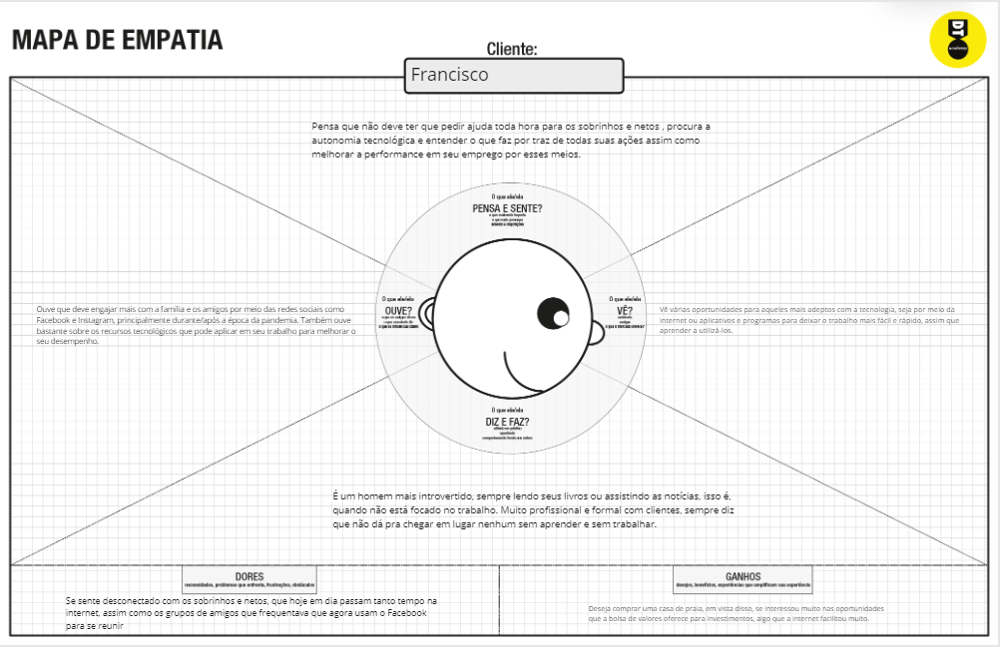
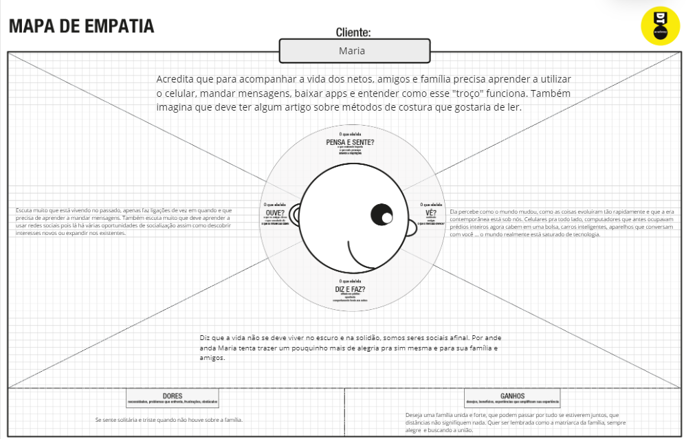

# Informações do Projeto
`Plataforma para auxiliar mais velhos a aprender tecnologias`  

`Engenharia de Software` 

## Participantes

Bruno Castanheira Marquezine

Daniel Bezerra Alves

Fernando Lucio Mello do Couto

Filipe Faria Melo

# Estrutura do Documento

- [Informações do Projeto](#informações-do-projeto)
  - [Participantes](#participantes)
- [Estrutura do Documento](#estrutura-do-documento)
- [Introdução](#introdução)
  - [Problema](#problema)
  - [Objetivos](#objetivos)
  - [Justificativa](#justificativa)
  - [Público-Alvo](#público-alvo)
- [Especificações do Projeto](#especificações-do-projeto)
  - [Personas e Mapas de Empatia](#personas-e-mapas-de-empatia)
  - [Histórias de Usuários](#histórias-de-usuários)
  - [Requisitos](#requisitos)
    - [Requisitos Funcionais](#requisitos-funcionais)
    - [Requisitos não Funcionais](#requisitos-não-funcionais)
  - [Restrições](#restrições)
- [Projeto de Interface](#projeto-de-interface)
  - [User Flow](#user-flow)
  - [Wireframes](#wireframes)
- [Metodologia](#metodologia)
  - [Divisão de Papéis](#divisão-de-papéis)
  - [Ferramentas](#ferramentas)
  - [Controle de Versão](#controle-de-versão)
- [**############## SPRINT 1 ACABA AQUI #############**](#-sprint-1-acaba-aqui-)
- [Projeto da Solução](#projeto-da-solução)
  - [Tecnologias Utilizadas](#tecnologias-utilizadas)
  - [Arquitetura da solução](#arquitetura-da-solução)
- [Avaliação da Aplicação](#avaliação-da-aplicação)
  - [Plano de Testes](#plano-de-testes)
  - [Ferramentas de Testes (Opcional)](#ferramentas-de-testes-opcional)
  - [Registros de Testes](#registros-de-testes)
- [Referências](#referências)

# Introdução

## Problema

O crescimento do número de idosos tem acelerado no Brasil em função da consolidação da urbanização. Nesse cenário, podemos observar que a terceira idade não consegue acompanhar a evolução tecnológica e muitas vezes isso resulta em algum tipo de isolamento social já que nos tempos modernos muito das relações com amigos e familiáres tem-se a distancia encurtada devido a interações com aparelhos e redes sociais. E isso é um grande problema para nossos queridos vovôs e vovós já que sua grande maioria apresentam dificuldades em coisas simples como uso do telefone, tablet, computadores e suas redes sociais.

A maioria dos idosos preferem ter seu espaço, pois eles não gostam de incomodar seus entes queridos por qualquer motivo, e muitas vezes quando pedem ajuda aos filhos ou netos, nem sempre estão disponíveis ou com paciência. Nesse momento, a tecnologia aparece como uma solução eficaz para melhorar a comunicação e facilitar a rotina na terceira idade.

## Objetivos

O objetivo geral deste trabalho é o desenvolvimento de um portal gratuito onde será possível realizar consulta e cadastro de tutoriais de tecnologia que atenda de forma intuitiva às principais dúvidas na hora de manusear aparelhos ou redes sociais.

Como objetivos específicos podemos ressaltar:

• Cadastros de tutoriais de tecnologia, de maneira simples e objetiva.

• Cadastro de para usuários que desejam contribuir com algum conhecimento do ramo tecnológico.

• Página para consulta dos tutoriais já cadastrados.

## Justificativa

A tecnologia e idosos estão cada vez mais conectados. Isso porque a tecnologia tem melhorado a qualidade de vida da terceira idade, fazendo com que eles se sintam mais informados, jovens e enriquecidos. Nesse sentido, ela deve fazer parte do dia a dia dos idosos.

Além disso, a tecnologia os tornam mais independentes, facilitando suas rotinas, sem precisar ficar pedindo auxílio para filhos e netos realizarem alguma atividade.

Este trabalho mostrará a você como a tecnologia pode beneficiar a vida na terceira idade, melhorando os seus relacionamentos sociais e autonomia.

## Público-Alvo

Neste trabalho, iremos focar nos idosos que, por sua vez possuem grandes dificuldades em manusear aparelhos tecnológico, aplicativos e redes sociais em geral.

 
# Especificações do Projeto

Considerando que a plataforma a ser desenvolvida neste projeto deve atender tanto aos usuários alunos (pessoas interessadas em aprender tecnologia) quanto aos usuários professores (pessoas interessadas em contribuir com conhecimento tenológico), a definição dos problemas a serem tratados neste projeto foi feita através de duas abordagens. Primeiro, criamos um formulário que enviamos para diversas pessoas interessas em aprender tecnologia. Segundo, utilizamos levantamento sobre perfil de entrevistados.

1-Personas e Mapa de Empatia: Feitos com base nas entrevistas e nos highlights;

2-Historias de Usuário: Elaborado com base nas entrevistas;

3-Requisitos (Funcionais e Não-Funcionais): Construídos embasados em nossas ideias para o programa e as necessidades dos usuários;

4-Restrições: Descobertas apartir de reuniões e discussões sobre o projeto;

## Personas e Mapas de Empatia

### Francisco / Chico

Idade: 55 Anos.

Hobbie: Ler livros, assistir filmes, séries, pescar e receber os netos.

Trabalho: Advogado.

Personalidade: Bastante focado, introvertido e detalhista.

Sonhos: Comprar uma casa de praia após sua aposentadoria, onde pode curtir com sua família e amigos.

Objetos e Lugares (Quais objetos físicos e digitais essa pessoa usa? Quando, onde e como ela os usa?): Francisco costuma usar o celular para ligações e trocas de mensagem, também usa o computador para realizar tarefas básicas em seu ambiente de trabalho. Além disso, ele não sai de casa sem o seu óculos de grau e sua maleta.

Objetivos Chave (Quais são os objetivos chave da pessoa durante a utilização do serviço? Por que eles precisam deste serviço?): Ampliar o seu conhecimento tecnológico para poder otimizar suas tarefas rotineiras sem a necessidade do auxílio de algum terceiro.

### Maria

Idade: 72 Anos.

Hobbie: Jogar bingo, assistir novela e costurar.

Trabalho: Aposentada.

Personalidade: Alegre e extrovertida.

Sonhos: Ver todos os netos formados.

Objetos e Lugares (Quais objetos físicos e digitais essa pessoa usa? Quando, onde e como ela os usa?): Ela sempre usa a sua máquina de costura para fazer roupas para seus filhos e netos, também utiliza seu telefone para ligações.

Objetivos Chave (Quais são os objetivos chave da pessoa durante a utilização do serviço? Por que eles precisam deste serviço?): O objetivo chave seria aprender o uso básico do celular como redes sociais, aplicativos e troca de mensagens.

## Histórias de Usuários

Com base na análise das personas forma identificadas as seguintes histórias de usuários:

|EU COMO... `PERSONA`       | QUERO/PRECISO ... `FUNCIONALIDADE`          |PARA ... `MOTIVO/VALOR`                                                                   |
|---------------------------|---------------------------------------------|------------------------------------------------------------------------------------------|
|Administrador do sistema   |     Cadastrar um novo tutorial              |  Divulgar o tutorial no portal.                                                          |
|Usuário do sistema         |     Me cadastrar no portal                  |  Tornar administrador e obter permissão para cadastro de tutoriais.                      |
|Usuário do sistema         |     Visualizar tutoriais já cadastrados     |  Aprendizado.                                                                            |
|Administrador do sistema   |     Editar dados dos tutoriais cadastrados  |  Modificar informações em tutoriais devido as mudanças tecnologicas que podem surgir.    |
|Administrador do sistema   |     Excluir tutoriais cadastrados           |  Remoção de tutoriais de tecnologias que tornaram-se obsoletos ou que entraram em desuso.|
|Usuário do sistema         |     Acessar o glossário                     |  Verificar o signifcando de um termo.                                                    |
  

## Requisitos

As tabelas a seguir apresentam os requisitos funcionais e não funcionais que detalham o escopo do projeto.

### Requisitos Funcionais

|ID    |                             Descrição do Requisito                                             | Prioridade |
|------|------------------------------------------------------------------------------------------------|------------|
|RF-001| O sistema deve apresentar, para cada tipo de tecnologia sua descrição correspondente           |    MÉDIA   | 
|RF-002| A página inicial do site deverá conter botões que direcione o usuário para o tutorial desejado |    ALTA    |
|RF-003| O site deverá conter informações sobre tipos de tecnologias                                    |    MÉDIA   |
|RF-004| O sistema deverá conter um campo para cadastro de usuários professores                         |    ALTA    |
|RF-005| O site precisa ter uma página de login para usuários já cadastrados                            |    ALTA    |
|RF-006| O site deve conter uma página para cadastro de novos tutoriais                                 |    ALTA    |
|RF-007| O site precisa conter a opção de edição de tutoriais por usuários já cadastrados               |    MÉDIA   |
|RF-008| O site precisa conter a oção de excluir tutoriais por usuários já cadastrados                  |    MÉDIA   |
|RF-009| O site deverá conter uma página para visualização de tutoriais cadastrados                     |    ALTA    |
|RF-010| O site deverá conter uma interface diferenciada para usuários com e sem cadastro               |    MÉDIA   |

### Requisitos não Funcionais

|ID     |                      Descrição do Requisito                         |Prioridade |
|-------|---------------------------------------------------------------------|-----------|
|RNF-001| O site deve ser compatível com os principais navegadores do mercado |    ALTA   | 
|RNF-002| Deve processar requisições do usuário em no máximo 5s               |   BAIXA   | 
|RNF-003| O sistema deverá ser desenvolvido em linguagem HTML                 |    ALTA   |
|RNF-004| O sistema deve ser responsivo para rodar em dispositivos móveis     |   MÉDIA   |
|RNF-005| O sistema deverá se comunicar com o localstorage                    |    ALTA   |
|RNF-006| A aplicação terá utilização de JavaScript                           |   BAIXA   |
|RNF-007| O sistema deverá ter alta disponibilidade                           |   MÉDIO   |

## Restrições

O projeto está restrito pelos itens apresentados na tabela a seguir.

|ID|                    Restrição                                 |
|--|--------------------------------------------------------------|
|01| O projeto deverá ser entregue até o final do semestre        |
|02| A equipe não pode subcontratar o desenvolvimento do trabalho |

# Projeto de Interface

Apresentamos aqui a visão geral da interação do usuário através das telas do sistema, bem como os protótipos das telas com as suas funcionalidades.

## User Flow

[UserFlow](images/UserFlow.pdf)

## Wireframes

**Tela 1 - Página Inicial**

Página inicial do site com um breve texto.

**Tela 2 - Login**

Login para os usuários cadastrados entrarem em seu perfil. 

**Tela 3 - Cadastro usuário**

Formulário para os usuários cadastrarem-se no site.

**Tela 4 - Quem somos**

Onde ficara as informações sobre o projeto de adoção.

**Tela 5 - Adoção**

Onde fica as fotos e informações dos pets disponíveis para adoção e logo abaixo o formulário para cadastrar novos animais.

# Metodologia
Descreveremos aqui nossa metodologia de trabalho, incluindo as ferramentas para controle de versão, gerenciamento de projeto, apresentação e edição de código, bem como as metodologias que utilizamos na elaboração do projeto.

## Divisão de Papéis

Apresente a divisão de papéis entre os membros do grupo.

- Product Owner
   - Daniel Bezerra Alves
- Scrum Master
   - Filipe Faria Melo
- Desenvolvedores
   - Fernando Lucio Mello do Couto
- Designer
   - Bruno Castanheira Marquezine

## Ferramentas

As ferramentas empregadas no projeto são:

|              Ambiente             |             Plataforma          |
|-----------------------------------|---------------------------------|
| Gerenciamento do Projeto          | GitHub                          |
| Projeto de Interfaces e Wireframes| Miro                            |
| Editor de Código                  | Visual Studio Code              |
| Documentos de Apresentação        | Google Slides                   |
| Repositório de Código Fonte       | GitHub                          |
| Hospedagem                        | Heroku                          |

O editor de código foi o visual studio code porque ele possui uma integração com o git, além de já utilizarmos ele em outras matérias. As ferramentas de comunicação utilizadas foram o canvas e whatsapp, visto que são palataformas que todos já possuiam. Quanto aos wireframes foi utilizado o próprio miro já que é uma plataforma dinâmica no qual foi possível uma grande interação entre o time para confecção das telas de acordo em comum. O framework vai ser o bootstrap visto que a maioria do time já tem conhecimento do mesmo, além de que ele irá facilitar bastante a responsividade do projeto. A hospedagem será feita no heroku devido ao seu fácil uso, além de ser gratuito.

## Controle de Versão

A ferramenta de controle de versão adotada no projeto foi o Git, sendo que o Github foi utilizado como repositório remoto.
> 
> O projeto segue a seguinte convenção para o nome de branchs:
> 
> - `master`: versão estável já testada do software
> - `testing`: versão em testes do software
> 
> Quanto à gerência de issues, o projeto adota a seguinte convenção para
> etiquetas:
> 
> - `bugfix`: uma funcionalidade encontra-se com problemas
> - `feature`: uma nova funcionalidade precisa ser introduzida

> Quanto aos commits iremos adotar o padrão de Conventional Commits
> - `feat:` para uma nova feature
> - `fix:` para arrumar algo do projeto

# **############## SPRINT 1 ACABA AQUI #############**

# Projeto da Solução

......  COLOQUE AQUI O SEU TEXTO ......

## Tecnologias Utilizadas

......  COLOQUE AQUI O SEU TEXTO ......

> Descreva aqui qual(is) tecnologias você vai usar para resolver o seu
> problema, ou seja, implementar a sua solução. Liste todas as
> tecnologias envolvidas, linguagens a serem utilizadas, serviços web,
> frameworks, bibliotecas, IDEs de desenvolvimento, e ferramentas.
> Apresente também uma figura explicando como as tecnologias estão
> relacionadas ou como uma interação do usuário com o sistema vai ser
> conduzida, por onde ela passa até retornar uma resposta ao usuário.
> 
> Inclua os diagramas de User Flow, esboços criados pelo grupo
> (stoyboards), além dos protótipos de telas (wireframes). Descreva cada
> item textualmente comentando e complementando o que está apresentado
> nas imagens.

## Arquitetura da solução

......  COLOQUE AQUI O SEU TEXTO E O DIAGRAMA DE ARQUITETURA .......

> Inclua um diagrama da solução e descreva os módulos e as tecnologias
> que fazem parte da solução. Discorra sobre o diagrama.
> 
> **Exemplo do diagrama de Arquitetura**:
> 
> 

# Avaliação da Aplicação

......  COLOQUE AQUI O SEU TEXTO ......

> Apresente os cenários de testes utilizados na realização dos testes da
> sua aplicação. Escolha cenários de testes que demonstrem os requisitos
> sendo satisfeitos.

## Plano de Testes

......  COLOQUE AQUI O SEU TEXTO ......

> Enumere quais cenários de testes foram selecionados para teste. Neste
> tópico o grupo deve detalhar quais funcionalidades avaliadas, o grupo
> de usuários que foi escolhido para participar do teste e as
> ferramentas utilizadas.
> 
> **Links Úteis**:
> - [IBM - Criação e Geração de Planos de Teste](https://www.ibm.com/developerworks/br/local/rational/criacao_geracao_planos_testes_software/index.html)
> - [Práticas e Técnicas de Testes Ágeis](http://assiste.serpro.gov.br/serproagil/Apresenta/slides.pdf)
> -  [Teste de Software: Conceitos e tipos de testes](https://blog.onedaytesting.com.br/teste-de-software/)

## Ferramentas de Testes (Opcional)

......  COLOQUE AQUI O SEU TEXTO ......

> Comente sobre as ferramentas de testes utilizadas.
> 
> **Links Úteis**:
> - [Ferramentas de Test para Java Script](https://geekflare.com/javascript-unit-testing/)
> - [UX Tools](https://uxdesign.cc/ux-user-research-and-user-testing-tools-2d339d379dc7)

## Registros de Testes

......  COLOQUE AQUI O SEU TEXTO ......

> Discorra sobre os resultados do teste. Ressaltando pontos fortes e
> fracos identificados na solução. Comente como o grupo pretende atacar
> esses pontos nas próximas iterações. Apresente as falhas detectadas e
> as melhorias geradas a partir dos resultados obtidos nos testes.

# Referências

......  COLOQUE AQUI O SEU TEXTO ......

> Inclua todas as referências (livros, artigos, sites, etc) utilizados
> no desenvolvimento do trabalho.
> 
> **Links Úteis**:
> - [Formato ABNT](https://www.normastecnicas.com/abnt/trabalhos-academicos/referencias/)
> - [Referências Bibliográficas da ABNT](https://comunidade.rockcontent.com/referencia-bibliografica-abnt/)
