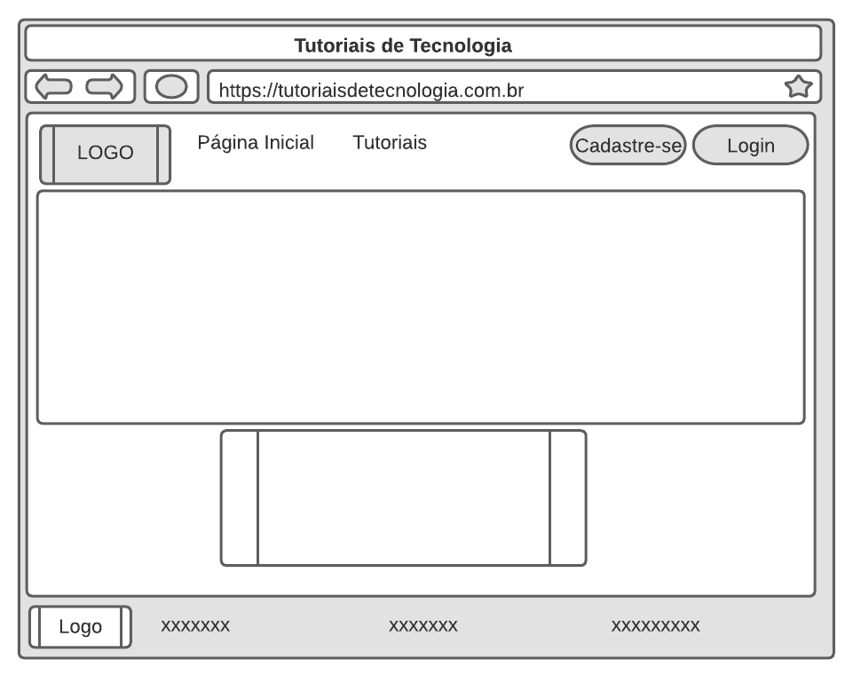
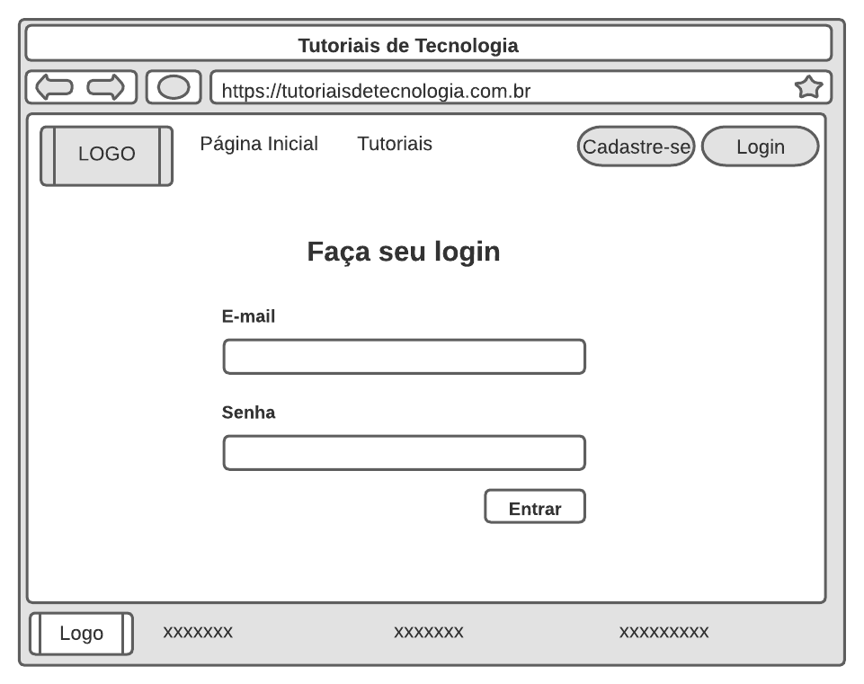
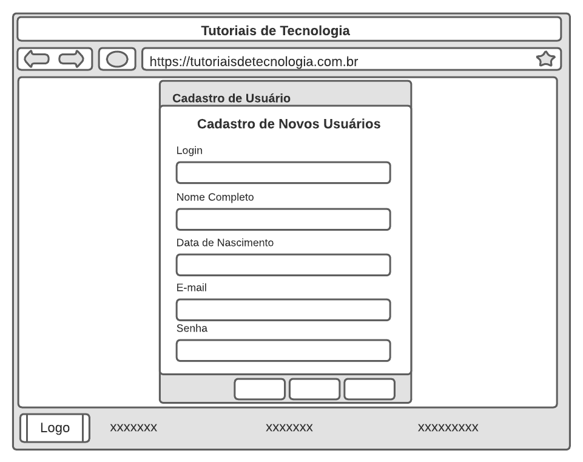
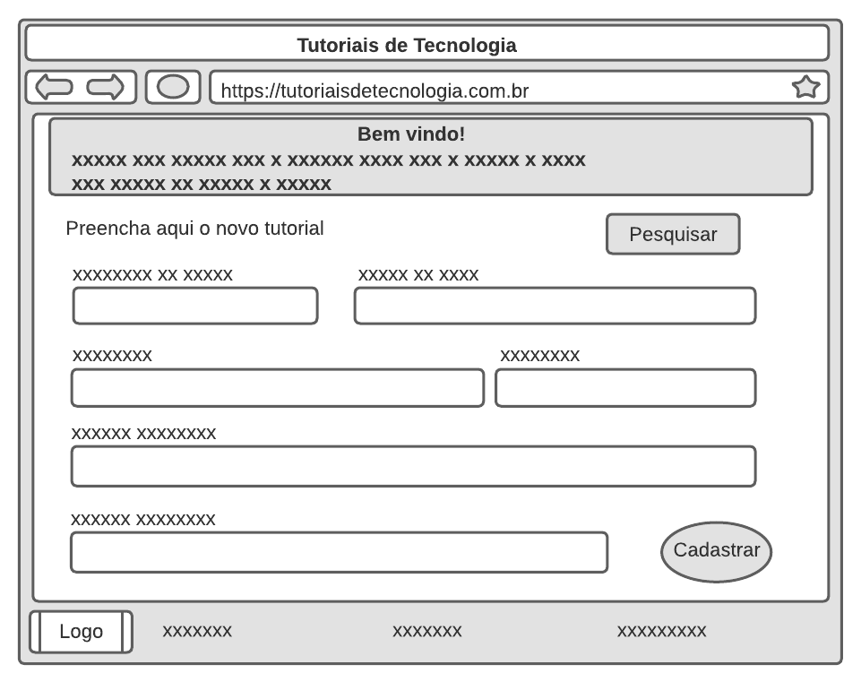
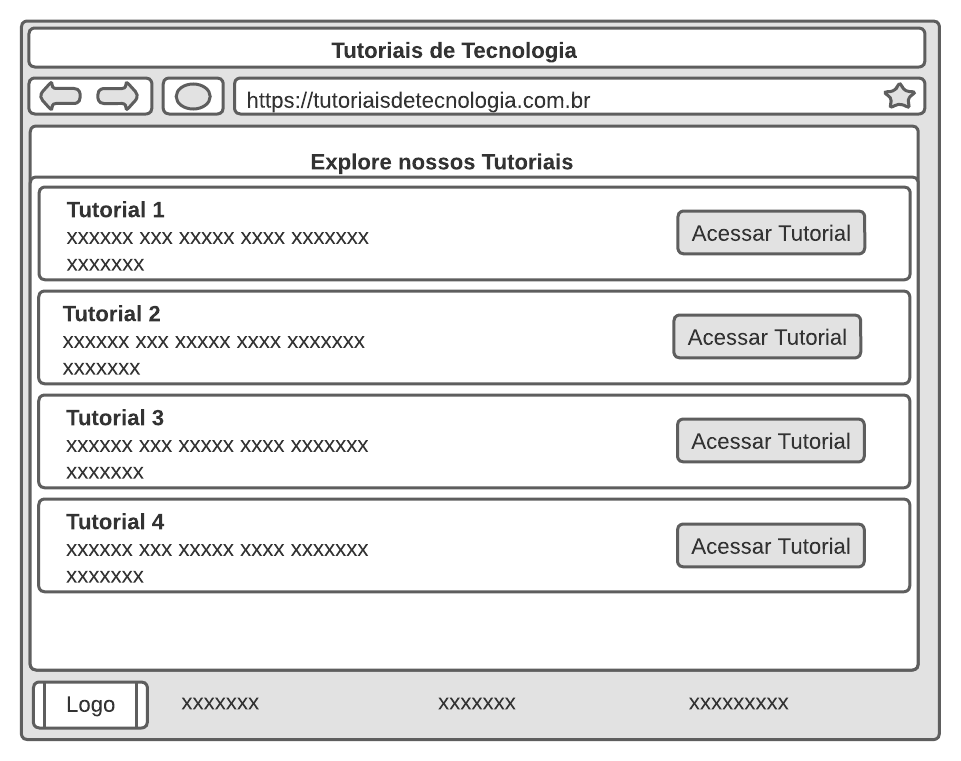
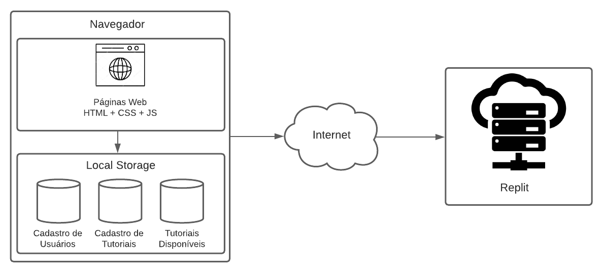

# Informações do Projeto
`Plataforma para auxiliar mais velhos a aprender tecnologias`  

`Engenharia de Software` 

## Participantes

Bruno Castanheira Marquezine

Daniel Bezerra Alves

Fernando Lucio Mello do Couto

# Estrutura do Documento

- [Informações do Projeto](#informações-do-projeto)
  - [Participantes](#participantes)
- [Estrutura do Documento](#estrutura-do-documento)
- [Introdução](#introdução)
  - [Problema](#problema)
  - [Objetivos](#objetivos)
  - [Justificativa](#justificativa)
  - [Público-Alvo](#público-alvo)
- [Especificações do Projeto](#especificações-do-projeto)
  - [Personas e Mapas de Empatia](#personas-e-mapas-de-empatia)
  - [Histórias de Usuários](#histórias-de-usuários)
  - [Requisitos](#requisitos)
    - [Requisitos Funcionais](#requisitos-funcionais)
    - [Requisitos não Funcionais](#requisitos-não-funcionais)
  - [Restrições](#restrições)
- [Projeto de Interface](#projeto-de-interface)
  - [User Flow](#user-flow)
  - [Wireframes](#wireframes)
- [Metodologia](#metodologia)
  - [Divisão de Papéis](#divisão-de-papéis)
  - [Ferramentas](#ferramentas)
  - [Controle de Versão](#controle-de-versão)
- [Projeto da Solução](#projeto-da-solução)
  - [Tecnologias Utilizadas](#tecnologias-utilizadas)
  - [Arquitetura da solução](#arquitetura-da-solução)
- [Avaliação da Aplicação](#avaliação-da-aplicação)
  - [Plano de Testes](#plano-de-testes)
  - [Registros de Testes](#registros-de-testes)
- [Referências](#referências)

# Introdução

## Problema

O crescimento do número de idosos tem acelerado no Brasil em função da consolidação da urbanização. Nesse cenário, podemos observar que a terceira idade não consegue acompanhar a evolução tecnológica e muitas vezes isso resulta em algum tipo de isolamento social já que nos tempos modernos muito das relações com amigos e familiáres tem-se a distancia encurtada devido a interações com aparelhos e redes sociais. E isso é um grande problema para nossos queridos vovôs e vovós já que sua grande maioria apresentam dificuldades em coisas simples como uso do telefone, tablet, computadores e suas redes sociais.

A maioria dos idosos preferem ter seu espaço, pois eles não gostam de incomodar seus entes queridos por qualquer motivo, e muitas vezes quando pedem ajuda aos filhos ou netos, nem sempre estão disponíveis ou com paciência. Nesse momento, a tecnologia aparece como uma solução eficaz para melhorar a comunicação e facilitar a rotina na terceira idade.

## Objetivos

O objetivo geral deste trabalho é o desenvolvimento de um portal gratuito onde será possível realizar consulta e cadastro de tutoriais de tecnologia que atenda de forma intuitiva às principais dúvidas na hora de manusear aparelhos ou redes sociais.

Como objetivos específicos podemos ressaltar:

• Cadastros de tutoriais de tecnologia, de maneira simples e objetiva.

• Cadastro de para usuários que desejam contribuir com algum conhecimento do ramo tecnológico.

• Página para consulta dos tutoriais já cadastrados.

## Justificativa

A tecnologia e idosos estão cada vez mais conectados. Isso porque a tecnologia tem melhorado a qualidade de vida da terceira idade, fazendo com que eles se sintam mais informados, jovens e enriquecidos. Nesse sentido, ela deve fazer parte do dia a dia dos idosos.

Além disso, a tecnologia os tornam mais independentes, facilitando suas rotinas, sem precisar ficar pedindo auxílio para filhos e netos realizarem alguma atividade.

Este trabalho mostrará a você como a tecnologia pode beneficiar a vida na terceira idade, melhorando os seus relacionamentos sociais e autonomia.

## Público-Alvo

Neste trabalho, iremos focar nos idosos que, por sua vez possuem grandes dificuldades em manusear aparelhos tecnológico, aplicativos e redes sociais em geral.

 
# Especificações do Projeto

Considerando que a plataforma a ser desenvolvida neste projeto deve atender tanto aos usuários alunos (pessoas interessadas em aprender tecnologia) quanto aos usuários professores (pessoas interessadas em contribuir com conhecimento tenológico), a definição dos problemas a serem tratados neste projeto foi feita através de duas abordagens. Primeiro, criamos um formulário que enviamos para diversas pessoas interessas em aprender tecnologia. Segundo, utilizamos levantamento sobre perfil de entrevistados.

1-Personas e Mapa de Empatia: Feitos com base nas entrevistas e nos highlights;

2-Historias de Usuário: Elaborado com base nas entrevistas;

3-Requisitos (Funcionais e Não-Funcionais): Construídos embasados em nossas ideias para o programa e as necessidades dos usuários;

4-Restrições: Descobertas apartir de reuniões e discussões sobre o projeto;

## Personas e Mapas de Empatia

### Francisco / Chico

Idade: 55 Anos.

Hobbie: Ler livros, assistir filmes, séries, pescar e receber os netos.

Trabalho: Advogado.

Personalidade: Bastante focado, introvertido e detalhista.

Sonhos: Comprar uma casa de praia após sua aposentadoria, onde pode curtir com sua família e amigos.

Objetos e Lugares (Quais objetos físicos e digitais essa pessoa usa? Quando, onde e como ela os usa?): Francisco costuma usar o celular para ligações e trocas de mensagem, também usa o computador para realizar tarefas básicas em seu ambiente de trabalho. Além disso, ele não sai de casa sem o seu óculos de grau e sua maleta.

Objetivos Chave (Quais são os objetivos chave da pessoa durante a utilização do serviço? Por que eles precisam deste serviço?): Ampliar o seu conhecimento tecnológico para poder otimizar suas tarefas rotineiras sem a necessidade do auxílio de algum terceiro.

### Maria

Idade: 72 Anos.

Hobbie: Jogar bingo, assistir novela e costurar.

Trabalho: Aposentada.

Personalidade: Alegre e extrovertida.

Sonhos: Ver todos os netos formados.

Objetos e Lugares (Quais objetos físicos e digitais essa pessoa usa? Quando, onde e como ela os usa?): Ela sempre usa a sua máquina de costura para fazer roupas para seus filhos e netos, também utiliza seu telefone para ligações.

Objetivos Chave (Quais são os objetivos chave da pessoa durante a utilização do serviço? Por que eles precisam deste serviço?): O objetivo chave seria aprender o uso básico do celular como redes sociais, aplicativos e troca de mensagens.

## Histórias de Usuários

Com base na análise das personas forma identificadas as seguintes histórias de usuários:

|EU COMO... `PERSONA`       | QUERO/PRECISO ... `FUNCIONALIDADE`          |PARA ... `MOTIVO/VALOR`                                                                   |
|---------------------------|---------------------------------------------|------------------------------------------------------------------------------------------|
|Administrador do sistema   |     Cadastrar um novo tutorial              |  Divulgar o tutorial no portal.                                                          |
|Usuário do sistema         |     Me cadastrar no portal                  |  Tornar administrador e obter permissão para cadastro de tutoriais.                      |
|Usuário do sistema         |     Visualizar tutoriais já cadastrados     |  Aprendizado.                                                                            |
|Administrador do sistema   |     Editar dados dos tutoriais cadastrados  |  Modificar informações em tutoriais devido as mudanças tecnologicas que podem surgir.    |
|Administrador do sistema   |     Excluir tutoriais cadastrados           |  Remoção de tutoriais de tecnologias que tornaram-se obsoletos ou que entraram em desuso.|
|Usuário do sistema         |     Acessar o glossário                     |  Verificar o signifcando de um termo.                                                    |
  

## Requisitos

As tabelas a seguir apresentam os requisitos funcionais e não funcionais que detalham o escopo do projeto.

### Requisitos Funcionais

|ID    |                             Descrição do Requisito                                             | Prioridade |
|------|------------------------------------------------------------------------------------------------|------------|
|RF-001| O sistema deve apresentar, para cada tipo de tecnologia sua descrição correspondente           |    MÉDIA   | 
|RF-002| A página inicial do site deverá conter botões que direcione o usuário para o tutorial desejado |    ALTA    |
|RF-003| O sistema deverá conter um campo para cadastro de usuários professores                         |    ALTA    |
|RF-004| O site precisa ter uma página de login para usuários já cadastrados                            |    ALTA    |
|RF-005| O site deve conter uma página para cadastro de novos tutoriais                                 |    ALTA    |
|RF-006| O site precisa conter a opção de edição de tutoriais por usuários já cadastrados               |    MÉDIA   |
|RF-007| O site precisa conter a opção de excluir tutoriais por usuários já cadastrados                 |    MÉDIA   |
|RF-008| O site deverá conter uma página para visualização de tutoriais cadastrados                     |    ALTA    |
|RF-009| O site deverá conter uma interface diferenciada para usuários com e sem cadastro               |    MÉDIA   |

### Requisitos não Funcionais

|ID     |                      Descrição do Requisito                         |Prioridade |
|-------|---------------------------------------------------------------------|-----------|
|RNF-001| O site deve ser compatível com os principais navegadores do mercado |    ALTA   | 
|RNF-002| Deve processar requisições do usuário em no máximo 5s               |   BAIXA   | 
|RNF-003| O sistema deverá ser desenvolvido em linguagem HTML                 |    ALTA   |
|RNF-004| O sistema deve ser responsivo para rodar em dispositivos móveis     |   MÉDIA   |
|RNF-005| O sistema deverá se comunicar com o localstorage                    |    ALTA   |
|RNF-006| A aplicação terá utilização de JavaScript                           |   BAIXA   |
|RNF-007| O sistema deverá ter alta disponibilidade                           |   MÉDIO   |

## Restrições

O projeto está restrito pelos itens apresentados na tabela a seguir.

|ID|                    Restrição                                 |
|--|--------------------------------------------------------------|
|01| O projeto deverá ser entregue até o final do semestre        |
|02| A equipe não pode subcontratar o desenvolvimento do trabalho |

# Projeto de Interface

Apresentamos aqui a visão geral da interação do usuário através das telas do sistema, bem como os protótipos das telas com as suas funcionalidades.

## User Flow

>

## Wireframes

**Tela 1 - Página Inicial**

Página inicial do site com um breve texto.

>

**Tela 2 - Login**

Login para os usuários cadastrados entrarem em seu perfil. 

>

**Tela 3 - Cadastro usuário**

Formulário para os usuários cadastrarem-se no site.

>

**Tela 4 - Cadastro de tutoriais**

Formulário para cadastro de novos tutoriais.

>

**Tela 5 - Lista de Tutoriais**

Lista de tutoriais disponíveis.

>

# Metodologia
Descreveremos aqui nossa metodologia de trabalho, incluindo as ferramentas para controle de versão, gerenciamento de projeto, apresentação e edição de código, bem como as metodologias que utilizamos na elaboração do projeto.

## Divisão de Papéis

Apresente a divisão de papéis entre os membros do grupo.

- Product Owner
   - Daniel Bezerra Alves
- Desenvolvedores
   - Fernando Lucio Mello do Couto
- Designer
   - Bruno Castanheira Marquezine

## Ferramentas

As ferramentas empregadas no projeto são:

|              Ambiente             |             Plataforma          |
|-----------------------------------|---------------------------------|
| Gerenciamento do Projeto          | GitHub                          |
| Projeto de Interfaces e Wireframes| Lucid                           |
| Editor de Código                  | Visual Studio Code              |
| Documentos de Apresentação        | Google Slides                   |
| Repositório de Código Fonte       | GitHub                          |
| Hospedagem                        | Replit                          |
| Banco de Dados                    | LocalStorage                    |

O editor de código foi o visual studio code porque ele possui uma integração com o git, além de já utilizarmos ele em outras matérias. As ferramentas de comunicação utilizadas foram o canvas e whatsapp, visto que são palataformas que todos já possuiam. Quanto aos wireframes foi utilizado o Lucid já que é uma plataforma dinâmica no qual foi possível uma grande interação entre o time para confecção das telas de acordo em comum. O framework vai ser o bootstrap visto que a maioria do time já tem conhecimento do mesmo, além de que ele irá facilitar bastante a responsividade do projeto. A hospedagem será feita no LocalStorage devido ao seu fácil uso, além de ser gratuito.

## Controle de Versão

A ferramenta de controle de versão adotada no projeto foi o Git, sendo que o Github foi utilizado como repositório remoto.
> 
> O projeto segue a seguinte convenção para o nome de branchs:
> 
> - `master`: versão estável já testada do software
> - `testing`: versão em testes do software
> 
> Quanto à gerência de issues, o projeto adota a seguinte convenção para
> etiquetas:
> 
> - `bugfix`: uma funcionalidade encontra-se com problemas
> - `feature`: uma nova funcionalidade precisa ser introduzida

> Quanto aos commits iremos adotar o padrão de Conventional Commits
> - `feat:` para uma nova feature
> - `fix:` para arrumar algo do projeto

# Projeto da Solução

Apresentaremos aqui a definição dos componentes do nosso site e nossa solução de hospedagem.

## Tecnologias Utilizadas

Em nosso projeto, iremos utilizar as seguintes tecnologias:

- **HTML 5** - A estrutura básica do site (texto, inserção de imagens, separação em containers) será feita em HTML.
- **CSS 3** - A estilização do site será feita em CSS, com possível utilização de frameworks como Bootstrap.
- **JavaScript** - Utilizaremos a linguagem JavaScript para inserir elementos de interação no site.
- **Git** - Será utilizado para realização do controle de versão dos documentos do projeto.
- **GitHub** - Será utilizado como repositório remoto do código-fonte e como ferramenta de gerenciamento de projeto.
- **Lucidchart** - Será utilizado na elaboração do Projeto de Interfaces e Wireframes e no tratamento das imagens que compõem o site.
- **Visual Studio Code** - Editor de código.
- **Power Point** - Utilizado na elaboração de apresentações.
- **Replit** - Será utilizado para hospedagem do site.
- **Localstorage** - Será utilizado para banco de dados.

## Arquitetura da solução

> 

 

A solução implementada conta com os seguintes módulos:
- **Navegador** - Interface básica do sistema  
  - **Páginas Web** - Conjunto de arquivos HTML, CSS, JavaScript e imagens que implementam as funcionalidades do sistema.
   - **Local Storage** - armazenamento mantido no Navegador, onde são implementados bancos de dados baseados em JSON. São eles: 
     - **Cadastro de Usuários** - cadastro de pessoas interessadas em compartilhar conhecimentos sobre tecnologia
     - **Cadastro de Tutoriais** - cadastro de tutoriais sobre tecnologia
     - **Tutoriais disponíveis** - Materiais disponíveis para aprendizado
 - **Hospedagem** - Nosso site será hospedado no servidor gratuito Replit.

# Avaliação da Aplicação

......  COLOQUE AQUI O SEU TEXTO ......

> Apresente os cenários de testes utilizados na realização dos testes da
> sua aplicação. Escolha cenários de testes que demonstrem os requisitos
> sendo satisfeitos.

## Plano de Testes

Os requisitos levantados para a execução dos testes forám os seguintes:

* Site já publicado
* Navegador da internet - Chrome ou Edge
* Conectividade com internet
* Massa de dados criada em banco de dados. 

Os testes funcionais a serem realizados no aplicativo são descritos a seguir:

 |`CASO DE TESTE`| CT01 Lista de tutoriais|
 |:-----------:|:---------:|
 |`REQUISITOS ASSOCIADOS`|RF-001 O sistema deve apresentar, para cada tipo de tecnologia sua descrição correspondente|
 |`OBJETIVO DO TESTE`| Verificar se os tutoriais disponíveis possuem descriçao.|
 |`MASSA DE TESTE`| Visualizar descrição na listagem de tutoriais.|
 |`PASSOS`| * Acessar o Navegador  * Informar a Url do site   * Visualizar a página principal  |
 |`CRITÉRIOS DE ÉXITO`| O usuário consegue visualizar a descrição do tutoriais disponíveis com sucesso.|

     

 |`CASO DE TESTE`| CT02 Botões funcionais que direcionem aos tutoriais|
 |:-----------:|:---------:|
 |`REQUISITOS ASSOCIADOS`|RF-002 A página inicial do site deverá conter botões que direcione o usuário para o tutorial desejado|
 |`OBJETIVO DO TESTE`| Verificar se os botões de atalho estão funcionais.|
 |`MASSA DE TESTE`| Clique no botão "Acessar tutorial".|
 |`PASSOS`| * Acessar o Navegador  * Informar a Url do site   * Visualizar a página principal   * Clicar em "Acessar tutorial"  |
 |`CRITÉRIOS DE ÉXITO`| O usuário será direcionado para os detalhes do tutorial selecionado.|

      

 |`CASO DE TESTE`| CT03 Cadastro de usuários|
 |:-----------:|:---------:|
 |`REQUISITOS ASSOCIADOS`|RF-003 O sistema deverá conter um campo para cadastro de usuários professores.|
 |`OBJETIVO DO TESTE`| Testar êxito no cadastro de novos usuários.|
 |`MASSA DE TESTE`| Clique no botão "Login".|
 |`PASSOS`| * Acessar o Navegador  * Informar a Url do site   * Visualizar a página principal   * Clicar em "Login"   * Clicar em "Criar conta".   * Preencher formulário"|
 |`CRITÉRIOS DE ÉXITO`| Exibir mensagem "Usuário salvo com sucesso."|

     

 |`CASO DE TESTE`| CT04 Login com sucesso de usuário cadastrado|
 |:-----------:|:---------:|
 |`REQUISITOS ASSOCIADOS`|RF-004 O site precisa ter uma página de login para usuários já cadastrados.|
 |`OBJETIVO DO TESTE`| Verificar se o usuário consegue realizar o login com usuário e senha corretas.|
 |`MASSA DE TESTE`|Usuário teste cadastrado do sistema   Usuário: teste  Senha: teste123|
 |`PASSOS`| * Acessar o Navegador  * Informar a Url do site   * Visualizar a página principal   * Realizar Login   *|
 |`CRITÉRIOS DE ÉXITO`| O usuário consegue acessar a plataforma com sucesso.|
 
    
 
 |`CASO DE TESTE`| CT05 Login sem sucesso de usuário cadastrado|
 |:-----------:|:---------:|
 |`REQUISITOS ASSOCIADOS`|RF-004 O site precisa ter uma página de login para usuários já cadastrados.|
 |`OBJETIVO DO TESTE`| Verificar se o usuário consegue realizar o login com usuário ou senha incorretos.|
 |`MASSA DE TESTE`|Login inválido e senha válida   Usuário: usuarioerrado  Senha: teste123|
 |`PASSOS`| * Acessar o Navegador   * Informar a Url do site   * Visualizar a página principal   * Informar login errado e senha correta|
 |`CRITÉRIOS DE ÉXITO`| O sistema deve emitir a mensagem "Usuário ou senha incorretos"|
 
    
 
 |`CASO DE TESTE`| CT06 Login sem sucesso de usuário cadastrado|
 |:-----------:|:---------:|
 |`REQUISITOS ASSOCIADOS`|RF-004 O site precisa ter uma página de login para usuários já cadastrados.|
 |`OBJETIVO DO TESTE`| Verificar se o usuário consegue realizar o login com usuário ou senha incorretos.|
 |`MASSA DE TESTE`|Login válido e senha inválida   Usuário: teste  Senha: senhaerrada|
 |`PASSOS`| * Acessar o Navegador   * Informar a Url do site   * Visualizar a página principal   * Informar login válido e senha incorreta|
 |`CRITÉRIOS DE ÉXITO`| O sistema deve emitir a mensagem "Usuário ou senha incorretos"|
 
    
 
 |`CASO DE TESTE`| CT07 Login sem sucesso de usuário cadastrado|
 |:-----------:|:---------:|
 |`REQUISITOS ASSOCIADOS`|RF-004 O site precisa ter uma página de login para usuários já cadastrados.|
 |`OBJETIVO DO TESTE`| Verificar se o usuário consegue realizar o login com usuário ou senha incorretos.|
 |`MASSA DE TESTE`|Login e senha inválidos   Usuário: usuarioerrado  Senha: senhaerrada|
 |`PASSOS`| * Acessar o Navegador   * Informar a Url do site   * Visualizar a página principal   * Informar login e senha inválidos|
 |`CRITÉRIOS DE ÉXITO`| O sistema deve emitir a mensagem "Usuário ou senha incorretos"|
 
   

 |`CASO DE TESTE`| CT08 Clique em "Cadastrar tutorial" sem login|
 |:-----------:|:---------:|
 |`REQUISITOS ASSOCIADOS`|RF-005 O site deve conter uma página para cadastro de novos tutoriais.|
 |`OBJETIVO DO TESTE`| Verificar se o usuário consegue realizar cadastro de tutorial sem login.|
 |`MASSA DE TESTE`|Clique em "Cadastrar tutorial" sem login.|
 |`PASSOS`| * Acessar o Navegador   * Informar a Url do site   * Visualizar a página principal   * Clicar em "Cadastrar tutorial"|
 |`CRITÉRIOS DE ÉXITO`| O sistema direcionará o usuário para a página de login.|
 
   

 |`CASO DE TESTE`| CT09 Clique em "Cadastrar tutorial" com login|
 |:-----------:|:---------:|
 |`REQUISITOS ASSOCIADOS`|RF-005 O site deve conter uma página para cadastro de novos tutoriais.|
 |`OBJETIVO DO TESTE`| Verificar se o usuário consegue realizar cadastro de tutorial com login.|
 |`MASSA DE TESTE`|Clique em "Cadastrar tutorial" com login.|
 |`PASSOS`| * Acessar o Navegador   * Informar a Url do site   * Visualizar a página principal   * Realizar login   * Clicar em "Cadastrar tutorial"|
 |`CRITÉRIOS DE ÉXITO`| O sistema direcionará o usuário para a página de cadastro de tutoriais.|
 
   

 |`CASO DE TESTE`| CT10 Cadastrando tutorial|
 |:-----------:|:---------:|
 |`REQUISITOS ASSOCIADOS`|RF-005 O site deve conter uma página para cadastro de novos tutoriais.|
 |`OBJETIVO DO TESTE`| Verificar se o usuário consegue realizar cadastro de tutorial com login.|
 |`MASSA DE TESTE`|* Título do tutorial: Teste Cadastro   * Dispositivo: Computador   * Categoria   * Breve descrição: teste   * Tutorial: teste|
 |`PASSOS`| * Acessar o Navegador   * Informar a Url do site   * Visualizar a página principal   * Realizar login   * Clicar em "Cadastrar tutorial"   * Preencher formulário   * Clicar em "Inserir"|
 |`CRITÉRIOS DE ÉXITO`| O tutorial cadastrado será adicionado a lista de tutoriais disponíveis para consulta.|
 
   

 |`CASO DE TESTE`| CT11 Editando tutorial|
 |:-----------:|:---------:|
 |`REQUISITOS ASSOCIADOS`|RF-006 O site precisa conter a opção de edição de tutoriais por usuários já cadastrados.|
 |`OBJETIVO DO TESTE`| Verificar se o usuário consegue realizar ediçao de tutorial já cadastrado.|
 |`MASSA DE TESTE`| Alterar nome "Teste Cadastro" para "Teste Edição"|
 |`PASSOS`| * Acessar o Navegador   * Informar a Url do site   * Visualizar a página principal   * Realizar login   * Clicar em "Cadastrar tutorial"   * Selecionar tutorial que deseja editar   * Realizar alteração   * Clicar em "Alterar"|
 |`CRITÉRIOS DE ÉXITO`| O tutorial editado será adicionado a lista de tutoriais disponíveis para consulta.|
 
   

 |`CASO DE TESTE`| CT12 Excluindo tutorial|
 |:-----------:|:---------:|
 |`REQUISITOS ASSOCIADOS`|RF-007 O site precisa conter a opção de excluir tutoriais por usuários já cadastrados.|
 |`OBJETIVO DO TESTE`| Verificar se o usuário consegue realizar exclusão de tutorial já cadastrado.|
 |`MASSA DE TESTE`| Excluir o tutorial nomeado como "Teste Edição"|
 |`PASSOS`| * Acessar o Navegador   * Informar a Url do site   * Visualizar a página principal   * Realizar login   * Clicar em "Cadastrar tutorial"   * Selecionar tutorial que deseja excluir   * Realizar alteração   * Clicar em "Excluir"|
 |`CRITÉRIOS DE ÉXITO`| O tutorial editado será removido da lista de tutoriais disponíveis para consulta.|
 
   

 |`CASO DE TESTE`| CT13 Visualizando tutoriais|
 |:-----------:|:---------:|
 |`REQUISITOS ASSOCIADOS`|RF-008 O site deverá conter uma página para visualização de tutoriais cadastrados.|
 |`OBJETIVO DO TESTE`| Verificar se o usuário consegue visualizar os tutoriais disponíveis.|
 |`MASSA DE TESTE`| Visualizar tutoriais|
 |`PASSOS`| * Acessar o Navegador   * Informar a Url do site   * Visualizar a página principal|
 |`CRITÉRIOS DE ÉXITO`| Usuário será direcionado para a página inicial do site no qual é aonde localiza-se todos os tutoriais disponíveis.|
 
   

 |`CASO DE TESTE`| CT14 Interface usuário sem cadastro|
 |:-----------:|:---------:|
 |`REQUISITOS ASSOCIADOS`|RF-009 O site deverá conter uma interface diferenciada para usuários com e sem cadastro.|
 |`OBJETIVO DO TESTE`| Verificar interface para usuários com e sem cadastro.|
 |`MASSA DE TESTE`| Entrar no site|
 |`PASSOS`| * Acessar o Navegador   * Informar a Url do site   * Visualizar a página principal|
 |`CRITÉRIOS DE ÉXITO`| Usuário consegue apenas visualizar os tutoriais disponíveis.|
 
   

 |`CASO DE TESTE`| CT15 Interface usuário com cadastro|
 |:-----------:|:---------:|
 |`REQUISITOS ASSOCIADOS`|RF-009 O site deverá conter uma interface diferenciada para usuários com e sem cadastro.|
 |`OBJETIVO DO TESTE`| Verificar interface para usuários com e sem cadastro.|
 |`MASSA DE TESTE`| * Entrar no site   * Realizar login|
 |`PASSOS`| * Acessar o Navegador   * Informar a Url do site   * Visualizar a página principal   * Realizar login|
 |`CRITÉRIOS DE ÉXITO`| Usuário consegue cadastrar, editar e remover tutoriais.|
 
   

## Registros de Testes

O seguintes casos de testes foram executados e com base nos resultados foram colhetadas as evidencias de cada um dos casos de testes. 

CT-01 – Lista de tutoriais 
CT-02 – Botões funcionais que direcionem aos tutoriais 
CT-03 – Cadastro de usuários 
CT-04 – Login com sucesso de usuário cadastrado 
CT-05 – Login sem sucesso de usuário cadastrado 
CT-06 – Login sem sucesso de usuário cadastrado 
CT-07 – Login sem sucesso de usuário cadastrado 
CT-08 – Clique em "Cadastrar tutorial" sem login 
CT-09 – Clique em "Cadastrar tutorial" com login 
CT-10 – Cadastrando tutorial 
CT-11 - Editando tutorial 
CT-12 - Excluindo tutorial 
CT-13 - Visualizando tutoriais 
CT-14 - Interface usuário sem cadastro 
CT-15 - Interface usuário com cadastro  

O relatório com as evidências dos testes de software realizados no sistema pode ser encontrado no seguinte link: <a href="Evidências de Testes"> Evidencias de testes</a>

# Referências

> - [Formato ABNT](https://www.normastecnicas.com/abnt/trabalhos-academicos/referencias/)
> - [Referências Bibliográficas da ABNT](https://comunidade.rockcontent.com/referencia-bibliografica-abnt/)
